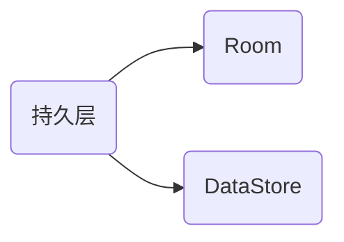

# 小型AI对话流 App（ChatRobot）

本项目定位为“小型 AI 对话流 App”，在移动端统一文本对话、图片理解与图片生成三条能力链路，提供顺畅、连贯且可扩展的产品体验。项目采用 Kotlin + Jetpack Compose 构建界面，MVVM + Repository 保持分层清晰，Room + DataStore 管理持久化数据，网络层以 Retrofit/OkHttp 接入 Doubao Ark（火山方舟）端点。你所做的改动也已纳入本 README：包括“思考时双圈动画指示”“数据存储功能”“登录功能”等。

## 一、基础项目说明

- 名称：ChatRobot（小型AI对话流 App）
- 目标：统一文本对话、视觉理解、文生图能力链路，兼顾性能与移动端体验
- 框架：Kotlin、Jetpack Compose、MVVM、Room、DataStore、Retrofit/OkHttp、Navigation
- 设备要求：Android（JDK 17；Gradle Wrapper 8.9；AGP 8.7.0；Compose 编译器 1.5.14）

## 二、应用分析

- 文本对话：多轮会话，自动携带最近 10 条上下文，回复更连贯
- 图片理解：支持本地图片与网络图片，自动选择 `input_image` 或 `image_url`
- 图片生成：返回 `b64_json`，在聊天气泡内直接显示
- 历史会话：标题（≤12 字）、摘要（首条问题 + 最近回答）、重命名、删除
- 模型选择：横向卡片选择文本/视觉/文生图及自定义 `ep-...` 接入点
- 主题与 UI：统一浅灰主题，顶部栏随浅色/深色模式切换；输入栏贴底
- 失败重试：失败消息右侧显示红色感叹号，点击重试最近用户消息；列表尾部显示统一 Typing 指示
- 思考指示：你新增的双圈思考动画，显示模型响应中的“思考状态”与“输出准备”两个阶段

## 三、功能介绍

- 与机器人智能聊天（核心）：文本对话、上下文记忆与自动标题
- 图片理解：本地 `content://` 自动转 Base64 以 `input_image` 提交；网络 `http(s)` 以 `image_url` 提交
- 图片生成：文生图返回 `b64_json`，聊天气泡内直接展示
- 历史会话：标题（≤12 字）、摘要（首条问题 + 最近回答）、重命名与删除
- 模型选择：横向卡片切换文本/视觉/文生图及 `ep-...` 接入点
- 登录与用户：注册/登录；登录后加载用户专属数据与配置
- 数据存储：持久化消息、会话、配置与用户数据；主题与字体偏好存储于 DataStore
- 思考双圈动画：两个独立圆形指示器分别代表“思考/推理中”和“结果生成中”，与你的 UI 设定一致

## 四、应用架构

### 持久层



持久层负责保存用户数据与应用配置，包括用户与机器人对话记录、会话摘要与标题、用户注册登录信息以及主题与字体偏好等。应用退出后重新进入时，先从数据库与 DataStore 获取数据并加载到界面，实现数据“持久”存在。

#### Room

实体（可按需增减）：
1. `Config`（配置表）
2. `Message`（消息表）
3. `User`（用户表）
4. `Conversation`（会话表，可选，用于管理会话级摘要与标题）

DAO（数据访问对象）：
- 提供插入/查询/更新的抽象接口，隐藏底层 SQL 复杂性

数据库类：
- `ChatDb` 聚合实体与 DAO，提供单例访问与迁移策略

#### DataStore

在不需要存储关系型数据的情况下，DataStore 适合存储简单键值对，开销较低。本应用使用 Preferences DataStore 存储主题与字体大小偏好，并以 Flow 方式获取，使 UI 能够快速响应配置变化。

### 网络层

网络层使用 Retrofit 对接口进行访问，OkHttp 管理连接与超时，并通过 Gson 将 JSON 数据转为预定义对象。考虑到视觉与文生图请求可能耗时较长，读/连/写超时统一设置为 60s。

示例返回对象：
```kotlin
data class ChatResponse(
    val id: String,
    val created: Int,
    val model: String,
    val choices: List<Choice>,
    val usage: Usage
)
```

### 界面层

界面层采用 Jetpack Compose，主要组件包括聊天消息列表与贴底输入栏，并通过 Navigation 组织多界面跳转。

### 视图层

视图层在 ViewModel 中保存界面需要的临时状态与长期状态，防止生命周期变动时数据丢失，同时将数据库与网络层抽象为数据流，提供稳定的 UI 数据源。

## 五、核心功能实现

### 一、获取机器人回复

在内存、速度与性能方面，频繁调用 Retrofit `create()` 成本较高。本应用仅保留一个 API 服务实例，并通过对象声明暴露给全局使用。网络层统一设置 60s 超时，避免复杂视觉/文生图请求被默认 14s 超时终止。

（此处省略具体第三方示意图与外部服务示例代码，网络层实现以本项目实际接口与配置为准）

ViewModel 请求与 UI 更新：
```kotlin
fun getAiReply(content: String) {
    updateMessageUiState(content, true) // 记录用户输入
    val requestBody = configUiState.toRequestBody(content)
    val call = ChatApi.retrofitService.getReply(requestBody)
    call.enqueue(object : Callback<ChatResponse> {
        override fun onResponse(call: Call<ChatResponse>, response: Response<ChatResponse>) {
            response.body()?.choices?.getOrNull(0)?.let { choice ->
                viewModelScope.launch {
                    val realTimeConfig = withContext(Dispatchers.IO) { configRepository.getConfigByUserId(userId) }
                    if (realTimeConfig.id != 0) {
                        configUiState = configUiState.copy(robotName = realTimeConfig.robotName)
                    }
                    updateMessageUiState(choice.text.trim(), false)
                }
            }
        }
        override fun onFailure(call: Call<ChatResponse>, t: Throwable) { t.printStackTrace() }
    })
}
```

### 二、聊天界面的构建

总体架构为“聊天消息列表 + 贴底输入框”。列表采用 `LazyColumn`，输入区包含文本框与图片选择入口。

```kotlin
@Composable
fun ChatScreen(viewModel: MainViewModel = viewModel(factory = AppViewModelProvider.Factory)) {
    val listState = viewModel.listState
    Surface { Box(Modifier.fillMaxSize()) {
        Column(Modifier.fillMaxSize()) {
            ChatDisplay(viewModel, Modifier.height(510.dp), listState)
            UserInput(viewModel, listState)
        }
    }}
}
```

消息渲染：
```kotlin
@Composable
fun ChatDisplay(viewModel: MainViewModel, modifier: Modifier = Modifier, listState: LazyListState) {
    val chatUiState by viewModel.chatListState.collectAsState()
    Surface(modifier) {
        LazyColumn(Modifier.background(MaterialTheme.colors.background), state = listState) {
            items(chatUiState.chatList) { item -> MessageItem(messageUiState = item.toMessageUiState()) }
        }
    }
}
```

单条消息：
```kotlin
@Composable
fun MessageItem(messageUiState: MessageUiState) {
    Row(Modifier.padding(8.dp)) {
        Image(painter = painterResource(if (messageUiState.isSelf) R.drawable.user_avatar else R.drawable.robot_avatar),
            contentDescription = null,
            modifier = Modifier.size(40.dp).clip(CircleShape).border(1.5.dp, MaterialTheme.colors.secondaryVariant, CircleShape))
        Spacer(Modifier.width(8.dp))
        Column {
            Row {
                Text(text = messageUiState.name, color = MaterialTheme.colors.secondaryVariant, style = MaterialTheme.typography.subtitle2)
                Spacer(Modifier.width(4.dp))
                Text(text = messageUiState.dateStr, style = MaterialTheme.typography.subtitle2, fontWeight = FontWeight.Light, letterSpacing = 0.25.sp)
            }
            Spacer(Modifier.height(4.dp))
            Surface(shape = MaterialTheme.shapes.medium, elevation = 3.dp, color = if (messageUiState.isSelf) MaterialTheme.colors.secondary else MaterialTheme.colors.surface, modifier = Modifier.animateContentSize().padding(1.dp)) {
                SelectionContainer { Text(text = messageUiState.content, modifier = Modifier.padding(4.dp), style = MaterialTheme.typography.body1) }
            }
        }
    }
}
```

### 三、页面间导航（Navigation）

Navigation 组件由 `NavController`、`NavGraph`、`NavHost` 组成。应用包含登录页 `login` 与主界面 `home/{userId}` 两个主要路由。登录成功后将 `userId` 传入主界面，加载与该用户相关的数据。

```kotlin
@Composable
fun ChatNavHost(navController: NavHostController, modifier: Modifier = Modifier) {
    NavHost(navController = navController, startDestination = "login") {
        composable("login") { LoginScreen(navController = navController) }
        composable("home/{userId}", arguments = listOf(navArgument("userId") { type = NavType.IntType })) {
            MainScreen(navController = navController)
        }
    }
}
```

### 四、登录与注册

注册：校验两次密码一致与账号是否已存在，将密码进行不可逆加密（如 MD5）后存入数据库；注册成功后可直接登录。登录：校验账号与密码，返回用户信息时屏蔽敏感字段（如将 `password` 显示为 `******`）。

```kotlin
override suspend fun getUserByAccount(account: String, password: String): User {
    val res = userDao.getUserByAccount(account, password)
    return (res ?: User()).copy(password = "******")
}
```

### 五、持久层实现（详解）

实体定义：
```kotlin
@Entity(tableName = "message")
data class Message(
    @PrimaryKey(autoGenerate = true) val id: Int = 0,
    val name: String,
    val time: Long,
    val content: String,
    @ColumnInfo(name = "user_id") val userId: Int,
    val isSelf: Boolean
)
```

DAO 示例：
```kotlin
@Dao
interface MessageDao {
    @Insert(onConflict = OnConflictStrategy.IGNORE)
    suspend fun insert(message: Message)

    @Query("SELECT * from message WHERE id = :id")
    fun getMessage(id: Int): Flow<Message>

    @Query("Select * from  message where user_id = :userId order by time asc")
    fun getAllMessagesByUserId(userId: Int): Flow<List<Message>>
}
```

仓库封装：
```kotlin
class OfflineMessageRepository(private val messageDao: MessageDao) : MessageRepository {
    override fun getMessagesStreamByUserId(userId: Int): Flow<List<Message>> = messageDao.getAllMessagesByUserId(userId)
    override suspend fun insertMessage(message: Message) = messageDao.insert(message)
}
```

数据库实例：
```kotlin
@Database(entities = [Message::class, User::class, Config::class], version = 7, exportSchema = false)
abstract class ChatDb : RoomDatabase() {
    abstract val messageDao: MessageDao
    abstract val userDao: UserDao
    abstract val configDao: ConfigDao
}
```

### 六、DataStore（主题与字体偏好）

```kotlin
class UserPreferencesRepository(private val dataStore: DataStore<Preferences>) {
    private companion object {
        val IS_DARK_THEME = booleanPreferencesKey("is_dark_theme")
        val FONT_SIZE = stringPreferencesKey("font_size")
    }

    val themeConfig: Flow<Boolean> = dataStore.data.map { it[IS_DARK_THEME] ?: false }
    val fontConfig: Flow<String> = dataStore.data.map { it[FONT_SIZE] ?: "小" }

    suspend fun saveUserPreference(value: Boolean) { dataStore.edit { it[IS_DARK_THEME] = value } }
    suspend fun saveUserFontPreference(value: String) { dataStore.edit { it[FONT_SIZE] = value } }
}
```

## 六、数据流（Flow）实现

在持久层中返回 `Flow`，Room 会在后台线程运行查询并推送数据变化；ViewModel 使用 `stateIn` 将其转为 `StateFlow`，Compose 使用 `collectAsState()` 渲染。

```kotlin
val chatListState: StateFlow<ChatUiState> =
    messageRepository.getMessagesStreamByUserId(userId)
        .map { ChatUiState(it) }
        .stateIn(viewModelScope, SharingStarted.WhileSubscribed(5_000), ChatUiState())
```

## 七、主题的切换

本应用支持手动切换深色模式与调整全局字体大小，且配置持久化。`ChatRobotTheme` 从 `LoginViewModel` 获取偏好流并实时应用。

```kotlin
@Composable
fun ChatRobotTheme(loginViewModel: LoginViewModel = viewModel(factory = AppViewModelProvider.Factory), content: @Composable () -> Unit) {
    val themeState = loginViewModel.themeState.collectAsState().value
    val fontState = loginViewModel.fontState.collectAsState().value
    val colors = if (themeState) DarkColorPalette else LightColorPalette
    val fontTypography = when (fontState) { "小" -> TypographySmall; "中" -> TypographyMedium; "大" -> TypographyLarge; else -> TypographySmall }
    MaterialTheme(colors = colors, typography = fontTypography, shapes = Shapes, content = content)
}
```

## 八、思考双圈动画（你的改动）

为了更直观地体现模型处理过程，你新增了“思考时双圈动画指示”。实现思路：
- 在对话请求发出后显示两个独立的圆形指示器。
- 第一个圈表示“思考/推理中”，第二个圈表示“输出/生成中”。
- 当返回首包数据后，关闭第一个圈，仅保留第二个圈，待完整响应后全部关闭。

可参考 Compose 动画：
```kotlin
@Composable
fun ThinkingIndicators(showReasoning: Boolean, showGenerating: Boolean) {
    Row(Modifier.padding(8.dp)) {
        if (showReasoning) CircularProgressIndicator(modifier = Modifier.size(18.dp))
        Spacer(Modifier.width(8.dp))
        if (showGenerating) CircularProgressIndicator(modifier = Modifier.size(18.dp), color = MaterialTheme.colors.secondary)
    }
}
```

UI 放置策略：位于列表尾部的 Typing 行或顶部栏下方的状态区，避免遮挡消息内容。与失败重试不冲突，状态切换通过 ViewModel 控制。

## 九、数据存储功能（你的改动 + 现有设计）

- 消息与会话：Room 存储，每条消息记录时间戳、用户标识与是否为用户/机器人。
- 会话摘要与标题：在会话表或配置表里维护，生成规则为“首条用户问题 + 最近机器人回答”，标题限制 ≤12 字。
- 用户配置：DataStore 持久化主题与字体大小，应用启动或切换时立即生效。
- 登录态与账号：Room 存储用户信息（账号/加密密码/昵称/说明），登录后按 `userId` 过滤消息与会话。

## 十、错误处理与失败重试

- 显示失败：在消息右侧显示红色感叹号。
- 点击重试：直接重试最近一次用户消息，并保持上下文一致。
- 超时与网络失败：统一 60s 超时；必要时在 UI 提示检查网络/代理设置。

## 十一、构建与发布

- Debug 构建：`./gradlew.bat :app:assembleDebug`
- Release 构建：准备签名 `.jks` 并在 `build.gradle` 配置后执行 `:app:assembleRelease`
- 产物位置：`app/build/outputs/apk/`
- 版本号策略：`versionCode` + `versionName`，配合语义化发布

## 十二、配置

在项目根目录 `local.properties` 增加：
```
DOUBAO_API_KEY=你的Ark密钥
```
密钥不入库；`local.properties` 已在 `.gitignore` 中忽略。

## 十三、模型与能力链路（Doubao Ark）

- 文本/问答：`doubao-1-5-thinking-pro-250415`
- 视觉对话：`doubao-seed-1-6-vision-250815`（支持 `image_url` 与 `input_image`）
- 文生图：`doubao-seedream-4-0-250828`（返回 `b64_json`）
- 可扩展：添加你的视觉/文本 `ep-...` 接入点至模型列表并使用

## 十四、使用指南

- 文本对话：在首页输入问题并发送；每次请求自动携带最近 10 条上下文
- 图片理解：上传图片后输入提示（如“图片主要讲了什么？”）
  - 本地图片自动转 Base64，以 `input_image` 提交
  - 网络图片 URL 以 `image_url` 提交
- 图片生成：输入“帮我生成一张……图片”，返回的 `b64_json` 在气泡内直接显示
- 历史会话：在历史卡片查看标题/摘要，支持重命名与删除；点击切换当前会话
- 模型选择：在配置页横向卡片切换文本/视觉/文生图或你的 `ep-...`
- 双圈思考：请求发出后出现双圈指示，首包到达后仅保留生成圈，响应完成后关闭

## 十五、关键改动（相对于初始版本）

- 升级构建栈：Gradle/AGP/Kotlin/Compose 统一升级并切至 JVM 17
- 移除硬编码密钥，改为 `local.properties` 注入 `BuildConfig`
- 文本对话统一 Doubao，加入上下文打包与标题自动生成
- 视觉理解支持 `image_url` 与 `input_image`，上传本地图片自动编码
- 文生图改为 `b64_json` 展示，避免 URL 访问问题
- 登录与顶部栏统一随主题切换；输入框圆角化与贴底
- 失败重试改为失败消息 + 感叹号点击重试；保留列表尾 Typing 指示
- 新增双圈思考动画，区分推理与生成两个阶段

## 十六、目录索引

- `MainViewModel.kt`：能力调度、上下文与历史管理
- `network/ChatApiService.kt`：Doubao Ark 接口定义（文本/视觉/文生图）
- `domain/*`：请求/响应数据结构（`RequestBody`、`VisionRequest`、`ImageGenRequest` 等）
- `data/*`：实体、DAO、仓库、数据库（含会话与消息联动）
- `ui/*`：聊天/历史/配置/登录等界面；顶部与主题设置
- `ui/theme/Theme.kt`：浅灰主题与暗色/浅色切换

## 十七、常见问题（FAQ）

- 401 未授权：检查 `DOUBAO_API_KEY` 是否有效并开通对应能力；视觉模型输入类型是否匹配
- 视觉仅 `image_url`：需将本地图片上传到可公网访问的存储（如 TOS），再传 `image_url`
- Gradle/同步提示：确认 `gradle-wrapper.properties` 为 8.9，IDE Gradle JDK 为 17
- 思考双圈不显示：检查 ViewModel 的状态切换逻辑与 Compose 条件渲染
- 登录失败：检查账号是否存在与密码加密逻辑；打印日志便于定位

## 十八、扩展与优化建议

- 上下文压缩：对长消息进行摘要或截断，避免上下文过长影响延迟与费用
- 图片处理：对大图采用采样与压缩，减少网络负载与解码开销
- Flow 背压：使用 `stateIn` 与 `SharingStarted` 控制订阅与资源占用
- UI 性能：使用 `key` 保持列表项稳定，拆分 Composable 减少重组
- 错误重试：可引入指数退避与失败分类提示

## 十九、日志与监控

- 本地日志：关键流程与失败信息记录到日志，便于调试与定位
- 崩溃分析：可选接入 Crashlytics 或其他平台，遵循隐私合规
- 埋点与统计：记录常用功能与错误分布（需用户授权与隐私声明）

## 二十、CI/CD 与版本管理

- CI 检查：在 CI 中执行 `./gradlew :app:assembleDebug` 与基础测试
- 代码规范：可选 ktlint/Detekt 进行静态检查
- 版本策略：语义化提交与变更记录，避免不可追溯的发布

## 二十一、许可协议

- 本项目依据 MIT License 开源（见仓库根目录 `LICENSE`）

---

### 附录 A：更多代码片段与流程示例

消息写入流程：
```kotlin
viewModelScope.launch {
    val msg = Message(name = "用户", time = System.currentTimeMillis(), content = userInput, userId = userId, isSelf = true)
    messageRepository.insertMessage(msg)
}
```

上下文打包：
```kotlin
fun List<Message>.packContext(limit: Int = 10): List<Message> = takeLast(limit)
```

图片 Base64 处理提示：
- 大图片建议压缩或采样后编码，避免超大请求体影响时延与成功率
- 避免在主线程执行编码与磁盘/网络 IO

双圈动画状态流：
```kotlin
data class ThinkingState(val reasoning: Boolean = false, val generating: Boolean = false)
val thinkingFlow: MutableStateFlow<ThinkingState> = MutableStateFlow(ThinkingState())
```

登录校验示例：
```kotlin
suspend fun login(account: String, password: String): Boolean {
    val enc = encode(password)
    val user = userRepository.getUserByAccount(account, enc)
    return user.id != 0
}
```

---

### 附录 B：构建命令与发布清单

- 构建 Debug：`./gradlew.bat :app:assembleDebug`
- 构建 Release：`./gradlew.bat :app:assembleRelease`
- 清理构建：`./gradlew.bat clean`

---

### 附录 C：术语表

- 文生图：文本生成图片
- 视觉理解：对图片进行内容解释或提取信息
- 上下文：多轮对话中用于保持连续性的历史消息片段
- Ark：Doubao Ark 模型与接口服务
